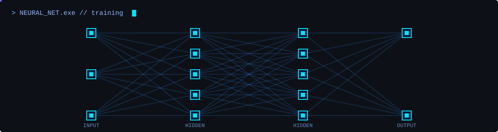

<!-- ===================== HERO (dark pixel animation) ===================== -->
<p align="center">
  
</p>

<p align="center">
  <a href="https://www.linkedin.com/in/sahil-haq-106595222/"></a>
  <a href="mailto:sahilhaq622@gmail.com"></a>
  <a href="https://github.com/sahilhaq2003?tab=repositories"></a>
  
</p>

<p align="center">
  
</p>

## `> whoami`

```typescript
const sahil = {
  role: "Data Science Undergraduate",
  focus: ["Machine Learning", "Deep Learning", "Data Analytics", "Full-Stack Development"],
  languages: ["Python", "SQL", "JavaScript", "Java"],
  currentlyBuilding: "Intelligent, data-driven web applications",
  currentlyLearning: ["Advanced Deep Learning", "Predictive Modeling", "Scalable Systems"],
  philosophy: "Turn raw data into real-world impact.",
  status: "Always learning, building, and improving",
};
```

---

## `> stack --list`

<div align="center">

| Domain | Technologies |
| :--- | :--- |
| 🧠 **Data Science & ML** |        |
| 🗄️ **Databases** |     |
| ⚙️ **Backend** |     |
| 🎨 **Frontend** |       |
| 🚀 **DevOps & Tools** |      |

</div>

<p align="center">
  
</p>

## `> projects --featured`

<div align="center">

### 🚔 Police360
**Police Information Management System**

*A full-stack, intelligent platform designed to modernize police operations through centralized data management, streamlined workflows, and data-driven insights.*


<a href="https://github.com/sahilhaq2003?tab=repositories"></a>

</div>

---

## `> focus --current`

<p align="center">
  
</p>

<table align="center">
  <tr>
    <td align="center" width="25%"><h3>🤖</h3><b>Machine Learning<br/>&amp; Deep Learning</b></td>
    <td align="center" width="25%"><h3>📈</h3><b>Predictive Modeling<br/>&amp; Data Insights</b></td>
    <td align="center" width="25%"><h3>🌐</h3><b>Intelligent Web<br/>Applications</b></td>
    <td align="center" width="25%"><h3>🧩</h3><b>Real-World<br/>Problem Solving</b></td>
  </tr>
</table>

---

## `> stats --live`

<p align="center">
  
  
</p>

<p align="center">
  
</p>

<p align="center">
  
</p>

---

## `> connect --open`

<p align="center">
  <a href="https://www.linkedin.com/in/sahil-haq-106595222/"></a>&nbsp;&nbsp;
  <a href="mailto:sahilhaq622@gmail.com"></a>&nbsp;&nbsp;
  <a href="https://github.com/sahilhaq2003"></a>
</p>

<p align="center"><i>Have an idea, a dataset, or a problem worth solving? Let's build something intelligent together.</i></p>

<p align="center">
  
</p>
